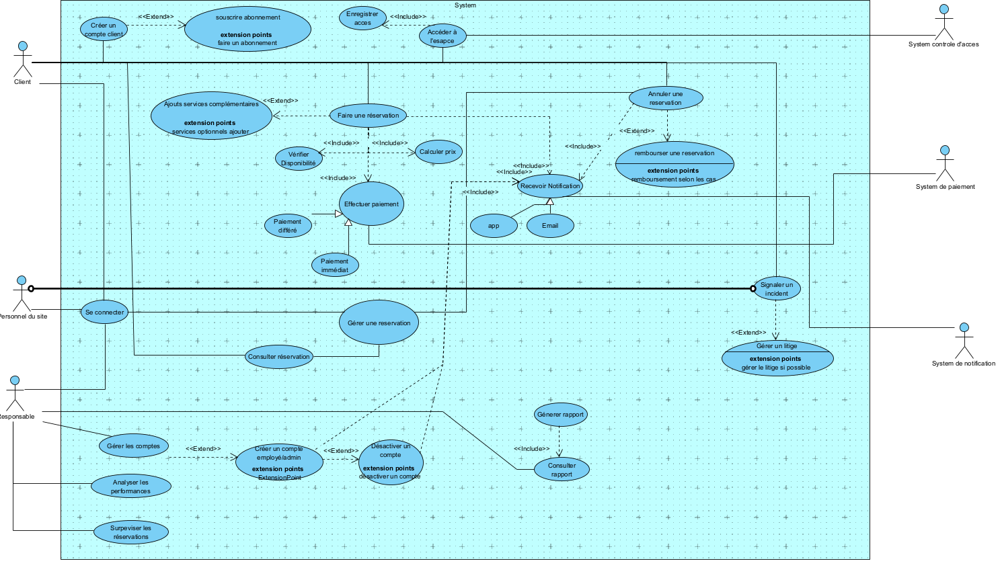

# HubWork

Projet d'analyse système (UML) réalisé dans le cadre du cours de projet d'analyse et de conception à l'EPHEC (Bruxelles), encadré par M. Charles De Groote — Projet 2026 : Système de gestion de réservations pour un réseau de coworkings.

## Contexte

L'objectif de ce travail est d'analyser une situation inspirée d'un contexte réel — un système de gestion de réservations pour une entreprise exploitant des espaces de coworking — et d'en proposer une modélisation complète à l'aide du langage UML (Unified Modeling Language).

Le système HubWork centralise la gestion des réservations, améliore la visibilité sur l'occupation des espaces et optimise l'expérience des utilisateurs ainsi que le travail du personnel. Il est pensé comme accessible via une application web et mobile.

## Acteurs

- Client — réserve des espaces de coworking, dispose d'un compte utilisateur
- Personnel sur site — gère les situations quotidiennes, consulte les réservations, intervient en cas d'incident
- Responsable — supervise les réservations, gère les comptes, analyse les performances
- Système de paiement, Système de notification, Système de contrôle d'accès — systèmes externes intégrés

## Diagramme global des cas d'utilisation

## Les 25 cas d'utilisation

Chaque cas d'utilisation fait l'objet d'une fiche complète (titre, acteurs, scénario, hypothèses, pré/postconditions) et d'un diagramme dédié dans le document d'analyse complet (HubWork_Analyse_UML.docx).

| # | Cas d'utilisation | Diagramme |
|---|---|---|
| 1 | Création d'un compte client | [voir](diagrams/01-creation-d-un-compte-client.png) |
| 2 | Se connecter | [voir](diagrams/02-se-connecter.png) |
| 3 | Recevoir une notification | [voir](diagrams/03-recevoir-une-notification.png) |
| 4 | Recevoir un e-mail | [voir](diagrams/04-recevoir-un-e-mail.png) |
| 5 | Recevoir une alerte dans l'application | [voir](diagrams/05-recevoir-une-alerte-dans-l-application.png) |
| 6 | Consulter les espaces disponibles | [voir](diagrams/06-consulter-les-espaces-disponibles.png) |
| 7 | Réserver un espace | [voir](diagrams/07-reserver-un-espace.png) |
| 8 | Payer une réservation | [voir](diagrams/08-payer-une-reservation.png) |
| 9 | Consulter ses réservations | [voir](diagrams/09-consulter-ses-reservations.png) |
| 10 | Modifier une réservation | [voir](diagrams/10-modifier-une-reservation.png) |
| 11 | Annuler une réservation | [voir](diagrams/11-annuler-une-reservation.png) |
| 12 | Accéder à l'espace réservé | [voir](diagrams/12-acceder-a-l-espace-reserve.png) |
| 13 | Ajouter des services complémentaires | [voir](diagrams/13-ajouter-des-services-complementaires.png) |
| 14 | Signaler un incident | [voir](diagrams/14-signaler-un-incident.png) |
| 15 | Ouvrir un litige | [voir](diagrams/15-ouvrir-un-litige.png) |
| 16 | Évaluer une réservation | [voir](diagrams/16-evaluer-une-reservation.png) |
| 17 | Souscrire un abonnement | [voir](diagrams/17-souscrire-un-abonnement.png) |
| 18 | Consulter les réservations du site | [voir](diagrams/18-consulter-les-reservations-du-site.png) |
| 19 | Gérer la disponibilité d'un espace | [voir](diagrams/19-gerer-la-disponibilite-d-un-espace.png) |
| 20 | Traiter un incident | [voir](diagrams/20-traiter-un-incident.png) |
| 21 | Gérer les comptes | [voir](diagrams/21-gerer-les-comptes.png) |
| 22 | Traiter un litige | [voir](diagrams/22-traiter-un-litige.png) |
| 23 | Suivre les performances | [voir](diagrams/23-suivre-les-performances.png) |
| 24 | Consulter les rapports | [voir](diagrams/24-consulter-les-rapports.png) |
| 25 | Générer des rapports | [voir](diagrams/25-generer-des-rapports.png) |

## Méthodologie et outils

- Modélisation UML : diagrammes de cas d'utilisation et diagrammes dédiés par scénario
- Documentation rédigée sous Word
- Soutenance orale de l'analyse devant le professeur

## Document complet

Le document d'analyse complet, avec les fiches détaillées de chaque cas d'utilisation (acteurs, scénario, hypothèses, pré/postconditions), est disponible ici : [HubWork_Analyse_UML.docx](HubWork_Analyse_UML.docx)
