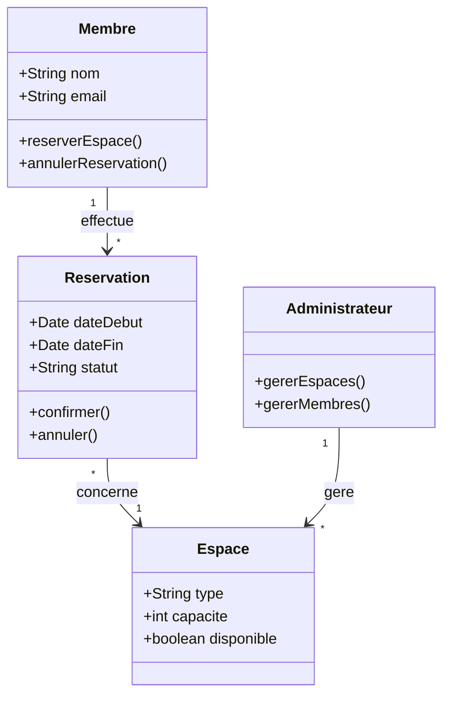
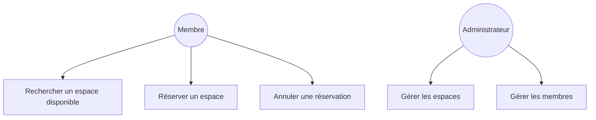

# HubWork

Projet d'analyse système réalisé dans le cadre du cours d'analyse des systèmes à l'EPHEC (Bruxelles), 2025-2026.

## Contexte

HubWork est une plateforme fictive de réservation d'espaces de coworking (bureaux, salles de réunion, postes de travail). Le projet consiste en une analyse complète du système avant développement : identification des besoins, modélisation UML et documentation, avec une soutenance orale devant le professeur.

## Contenu de l'analyse

- 25 cas d'utilisation couvrant la réservation d'espaces, la gestion des membres et l'administration de la plateforme
- Diagramme de cas d'utilisation
- Diagramme de classes
- Diagrammes d'états
- Diagrammes de séquence

## Exemple : diagramme de classes (simplifié)

## Exemple : cas d'utilisation principaux

## Méthodologie et outils

- Modélisation UML (cas d'utilisation, classes, états, séquences)
- Documentation générée en Word via python-docx
- Soutenance orale de l'analyse

## À venir

Ajout des diagrammes détaillés et du document d'analyse complet (25 cas d'utilisation).
